# Enterprise Vision AI - System Architecture

## Table of Contents

1. [System Overview](#system-overview)
2. [Layer Architecture](#layer-architecture)
3. [Component Architecture](#component-architecture)
4. [Deployment Architecture](#deployment-architecture)
5. [Data Flow Diagrams](#data-flow-diagrams)
6. [Technology Stack](#technology-stack)
7. [Security Considerations](#security-considerations)
8. [Scalability Patterns](#scalability-patterns)

---

## System Overview

Enterprise Vision AI is an industrial computer vision system designed for mineral defect detection and ore classification in mining operations. The system leverages YOLO11 (Ultralytics v8+) for instance segmentation, providing pixel-level masks for precise defect localization.

### High-Level Architecture

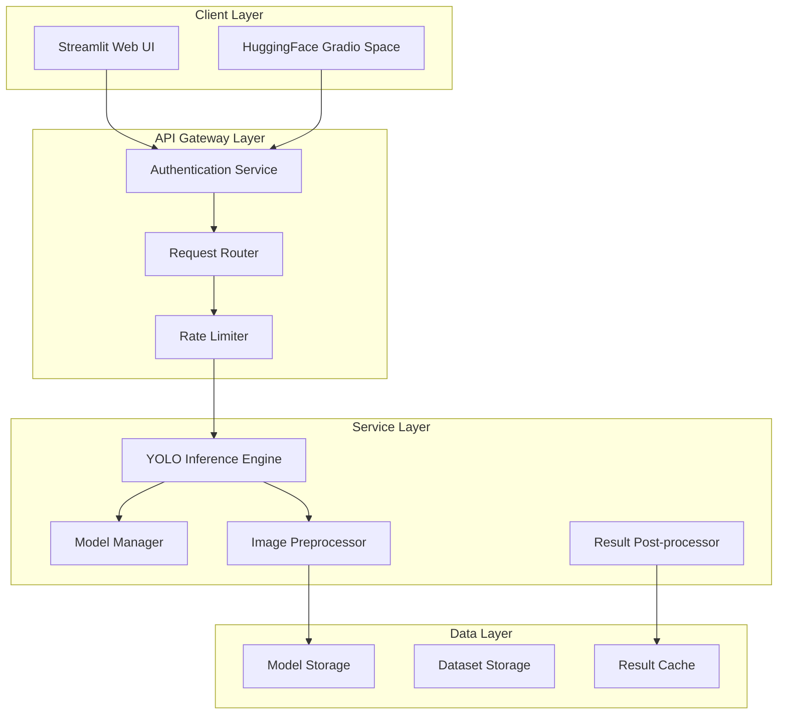

### Core Capabilities

| Capability | Description |
|------------|-------------|
| **Defect Detection** | Real-time surface defect detection (cracks, scratches, dents, discoloration, contamination) |
| **Ore Classification** | Mineral ore classification (magnetite, chromite, waste, low-grade) |
| **Instance Segmentation** | Pixel-level mask generation for defect localization |
| **Severity Assessment** | Automatic defect severity classification (low, medium, high) |
| **Maintenance Recommendations** | AI-driven maintenance suggestions based on detected defects |

---

## Layer Architecture

### 1. Client Layer

The Client Layer provides user interfaces for interacting with the vision AI system.

#### Components

| Component | Technology | Purpose |
|-----------|------------|---------|
| **Streamlit Web UI** | Streamlit (Python) | Primary production application with multi-page navigation |
| **HuggingFace Gradio** | Gradio (Python) | Cloud-based demo space for public access |
| **Mobile Interface** | Responsive Design | Mobile-friendly access via PWA |

#### Streamlit UI Structure

```
app.py                 # Main entry point with page routing
├── pages/
│   ├── 01_Defekt_Tespiti.py    # Defect Detection page
│   ├── 02_Cevher_On_Secimi.py   # Ore Classification page
│   ├── defect.py               # Defect detection implementation
│   └── ore.py                  # Ore classification implementation
```

#### HuggingFace Space Structure

```
huggingface_space/
├── app.py                 # Gradio application
├── requirements.txt       # Python dependencies
├── hardware.yaml         # Hardware configuration
└── README.md             # Space documentation
```

### 2. API Gateway Layer

The API Gateway Layer handles request routing, authentication, and rate limiting.

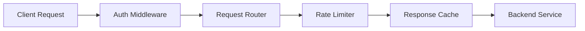

#### Responsibilities

| Responsibility | Implementation |
|----------------|----------------|
| **Authentication** | Session-based auth for Streamlit, API keys for HF Spaces |
| **Request Routing** | Path-based routing to appropriate service endpoints |
| **Rate Limiting** | Per-user rate limits to prevent abuse |
| **Response Caching** | LRU cache for frequently requested results |
| **Request Validation** | Input validation and sanitization |

### 3. Service Layer

The Service Layer contains the core business logic for AI inference.

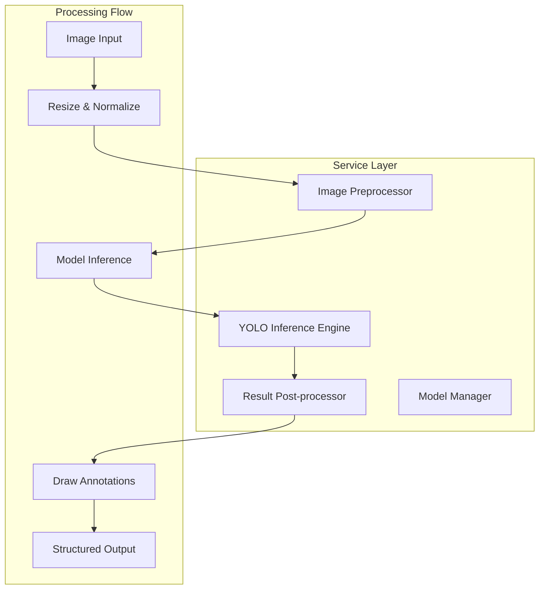

#### Core Services

| Service | File | Responsibility |
|---------|------|----------------|
| **YOLO Inference** | [`pages/defect.py`](pages/defect.py:33), [`pages/ore.py`](pages/ore.py:32) | Load and run YOLO models |
| **Model Management** | [`models/registry.yaml`](models/registry.yaml:1) | Model versioning and metadata |
| **Image Preprocessing** | [`utils.py`](utils.py:72) | Image resize, normalization, augmentation |
| **Result Post-processing** | [`utils.py`](utils.py:50) | Result formatting, annotation drawing |

### 4. Data Layer

The Data Layer manages models, datasets, and caching.

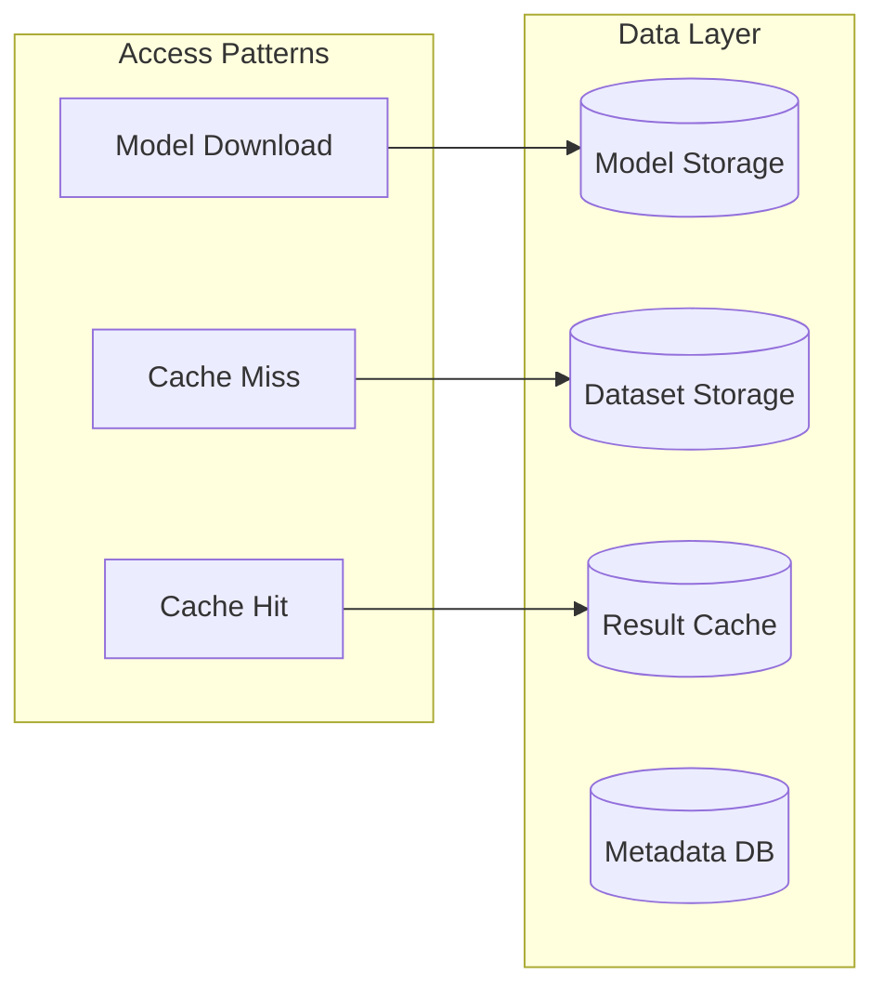

#### Storage Structure

```
models/
├── checkpoints/           # Trained model weights
├── .cache/              # Model cache directory
├── registry.yaml         # Model registry configuration
└── download_models.py   # Model download script

datasets/
├── defect_detection/    # YOLO format dataset
│   ├── train/          # Training images & labels
│   ├── val/            # Validation images & labels
│   ├── test/           # Test images & labels
│   └── dataset.yaml   # Dataset configuration
└── README.md           # Dataset documentation
```

---

## Component Architecture

### 1. Model Service

The Model Service manages YOLO model lifecycle.

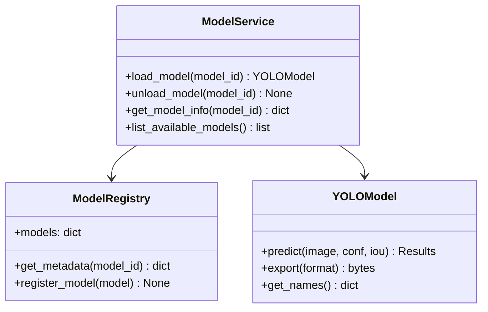

#### Model Configuration ([`models/registry.yaml`](models/registry.yaml:1))

```yaml
models:
  yolov8n-defect:
    type: "detection"
    framework: "ultralytics"
    input_size: 640
    classes: ["crack", "scratch", "dent", "discoloration", "contamination"]
  yolov8s-defect:
    type: "segmentation"
    framework: "ultralytics"
    input_size: 640
    classes: ["çatlak", "çizik", "delik", "leke", "deformasyon"]
```

#### Model Loading Pattern

```python
# From pages/defect.py:33
@st.cache_resource
def load_model():
    """Load YOLO model with fallback chain"""
    from ultralytics import YOLO
    
    try:
        model = YOLO('yolo26-seg.pt')
    except:
        try:
            model = YOLO('yolo11s-seg.pt')
        except:
            model = YOLO('yolo11n-seg.pt')
    
    return model
```

### 2. Dataset Service

The Dataset Service manages training and inference datasets.

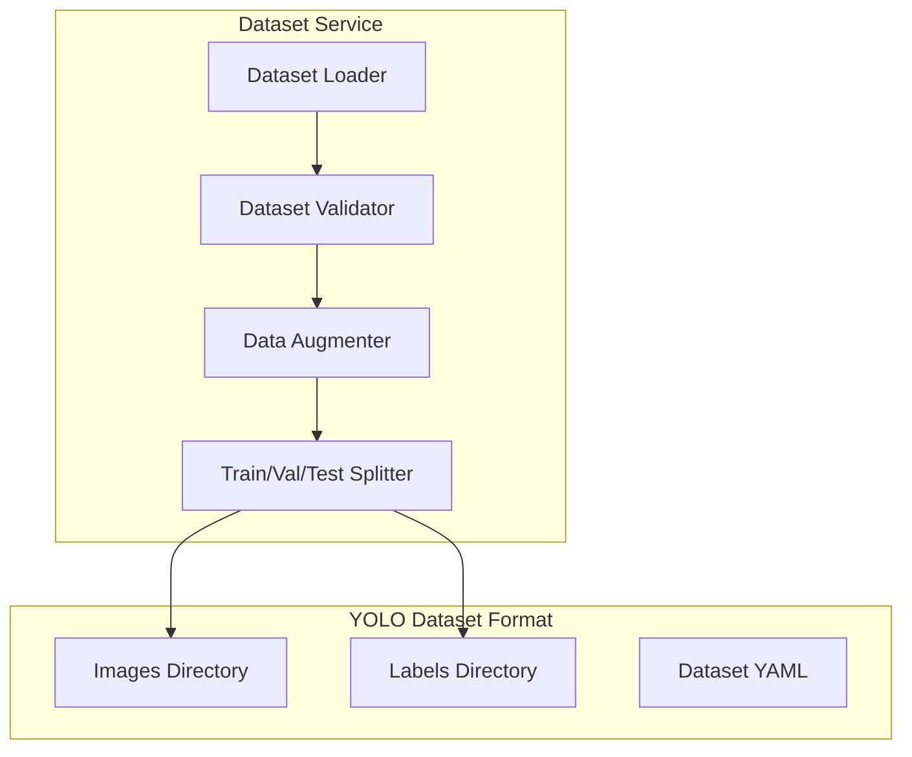

#### Dataset Configuration ([`datasets/defect_detection/dataset.yaml`](datasets/defect_detection/dataset.yaml:1))

```yaml
name: "BAS Defect Detection Dataset"
nc: 5  # Number of classes
names:
  0: crack
  1: scratch
  2: dent
  3: discoloration
  4: contamination
```

### 3. Inference Pipeline

The Inference Pipeline processes images through the complete detection workflow.

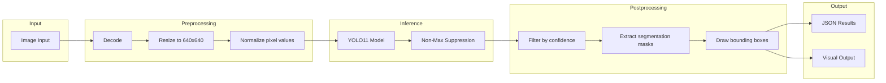

#### Inference Pipeline Implementation

```python
# From utils.py:72
def draw_annotations(image, results, class_colors, show_labels, show_confidence):
    """Draw detection annotations on image"""
    # Extract detections
    for result in results:
        boxes = result.boxes
        masks = result.masks
        
        # Draw bounding boxes
        for box in boxes:
            # Draw box with class color
            # Add label with confidence
            pass
        
        # Draw segmentation masks
        if masks is not None:
            # Overlay colored masks
            pass
    
    return annotated_image
```

---

## Deployment Architecture

### 1. Docker Containerization

The project uses multi-stage Docker builds for optimized production images.

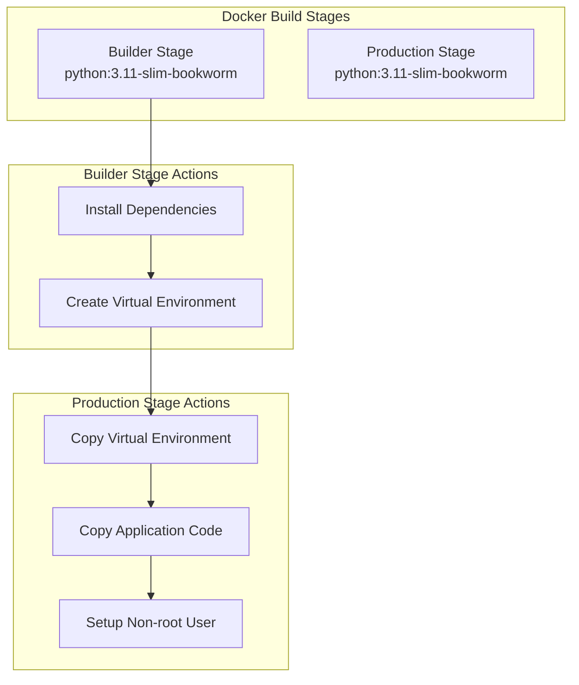

#### Dockerfile Stages ([`Dockerfile`](Dockerfile:1))

| Stage | Base Image | Purpose |
|-------|------------|---------|
| **Builder** | `python:3.11-slim-bookworm` | Install dependencies in isolated venv |
| **Production** | `python:3.11-slim-bookworm` | Minimal runtime image |
| **Development** | `python:3.11-slim-bookworm` | Development with live reload |

#### Docker Compose Configuration

```yaml
# From docker-compose.yml
services:
  app:
    build:
      context: .
      dockerfile: Dockerfile
      target: development
    ports:
      - "8501:8501"
    volumes:
      - .:/app
      - ./data:/app/data
      - ./models:/app/models
    environment:
      - STREAMLIT_SERVER_PORT=8501
    restart: unless-stopped
```

### 2. HuggingFace Space Deployment

The HuggingFace Space provides a cloud-based demo environment.

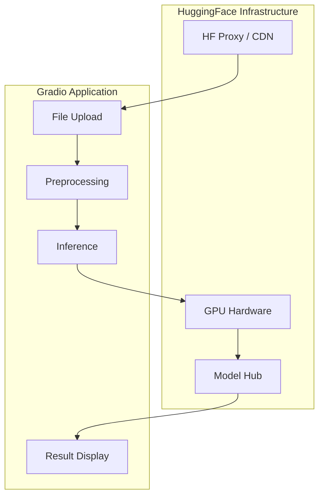

#### Hardware Configuration ([`huggingface_space/hardware.yaml`](huggingface_space/hardware.yaml:1))

```yaml
# Hardware specifications for HF Space
hardware:
  cpu: 2
  memory: 16GB
  gpu: T4  # Optional GPU for faster inference
  enable_accelerate: true
```

#### Gradio Application Structure ([`huggingface_space/app.py`](huggingface_space/app.py:1))

```python
# Key components in Gradio app
DEFECT_MODEL_ID = "bas-industriel/yolo-defect-detection"
ORE_MODEL_ID = "bas-industriel/yolo-ore-classification"

DEFECT_CLASSES = ["çizik", "çatlak", "delik", "ezilme", "yanık", "pas", "diğer"]
ORE_CLASSES = ["manyetit", "kromit", "pirit", "kalkopirit", "atık", "düşük tenörlü"]
```

### 3. Streamlit Cloud Deployment

The Streamlit application can be deployed to Streamlit Cloud.

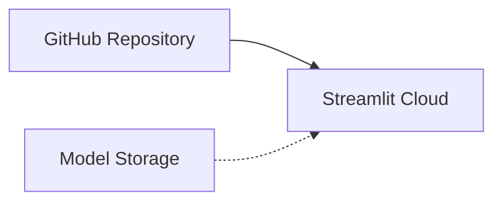

#### Deployment Configuration

| Environment | Platform | Configuration |
|-------------|----------|---------------|
| **Local** | Docker Compose | [`docker-compose.yml`](docker-compose.yml:1) |
| **Cloud** | Streamlit Cloud | GitHub integration |
| **Demo** | HuggingFace Space | Gradio interface |

---

## Data Flow Diagrams

### 1. Defect Detection Flow

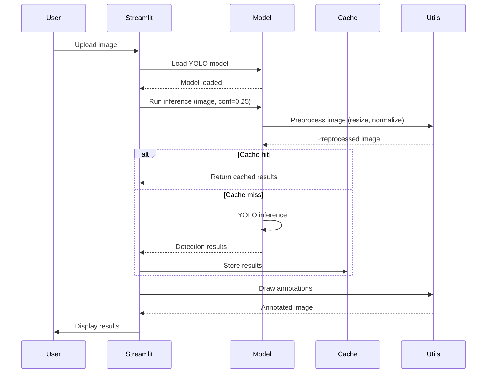

### 2. Ore Classification Flow

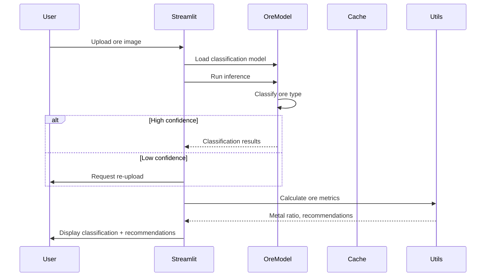

### 3. Batch Processing Flow

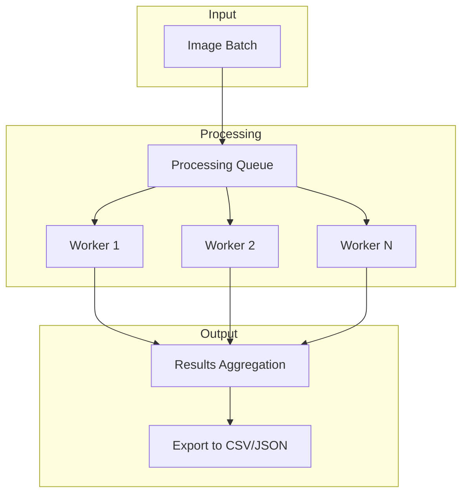

---

## Technology Stack

### Core Technologies

| Category | Technology | Version | Purpose |
|----------|------------|---------|---------|
| **AI Framework** | Ultralytics | v8+ | YOLO11 model inference |
| **Deep Learning** | PyTorch | 2.x | Neural network backend |
| **Computer Vision** | OpenCV | 4.x | Image processing |
| **Web Framework** | Streamlit | 1.x | Primary UI framework |
| **Demo Framework** | Gradio | 4.x | HF Space interface |

### Infrastructure

| Category | Technology | Purpose |
|----------|------------|---------|
| **Containerization** | Docker | Application packaging |
| **Orchestration** | Docker Compose | Local development |
| **Cloud Platform** | Streamlit Cloud | Production deployment |
| **Model Hub** | HuggingFace Hub | Model storage & distribution |

### Supporting Libraries

| Library | Purpose |
|---------|---------|
| NumPy | Numerical operations |
| Pandas | Data manipulation |
| Pillow (PIL) | Image handling |
| Numba | Performance optimization |

### Development Tools

| Tool | Purpose |
|------|---------|
| Python 3.11 | Runtime environment |
| Make | Build automation |
| pytest | Testing framework |
| Git | Version control |

---

## Security Considerations

### Authentication

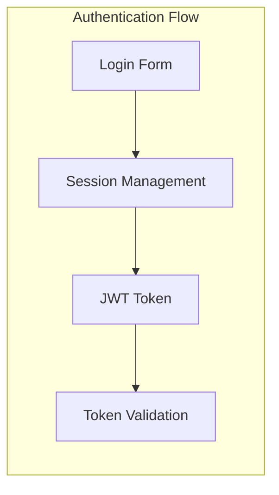

### Security Measures

| Measure | Implementation |
|---------|----------------|
| **Input Validation** | File type checking, size limits |
| **Output Sanitization** | HTML escaping in UI |
| **Secure Defaults** | Non-root container user |
| **Secrets Management** | Environment variables |

---

## Scalability Patterns

### Horizontal Scaling

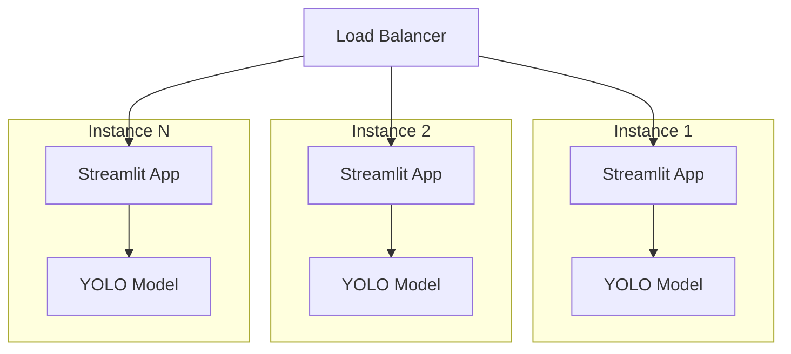

### Caching Strategy

| Cache Layer | Technology | TTL | Purpose |
|-------------|------------|-----|---------|
| **Model Cache** | `@st.cache_resource` | Persistent | Model weights |
| **Result Cache** | LRU Cache | 1 hour | Inference results |
| **Static Assets** | CDN | Long-term | CSS, JS, images |

---

## Appendix: File Reference

| File | Description |
|------|-------------|
| [`app.py`](app.py:1) | Main Streamlit application entry point |
| [`utils.py`](utils.py:1) | Shared utility functions |
| [`pages/defect.py`](pages/defect.py:1) | Defect detection page logic |
| [`pages/ore.py`](pages/ore.py:1) | Ore classification page logic |
| [`huggingface_space/app.py`](huggingface_space/app.py:1) | Gradio application |
| [`models/registry.yaml`](models/registry.yaml:1) | Model registry configuration |
| [`datasets/defect_detection/dataset.yaml`](datasets/defect_detection/dataset.yaml:1) | Dataset configuration |
| [`Dockerfile`](Dockerfile:1) | Docker image definition |
| [`docker-compose.yml`](docker-compose.yml:1) | Local deployment configuration |

---

*Last Updated: 2026-03-08*
*Architecture Version: 1.0.0*
